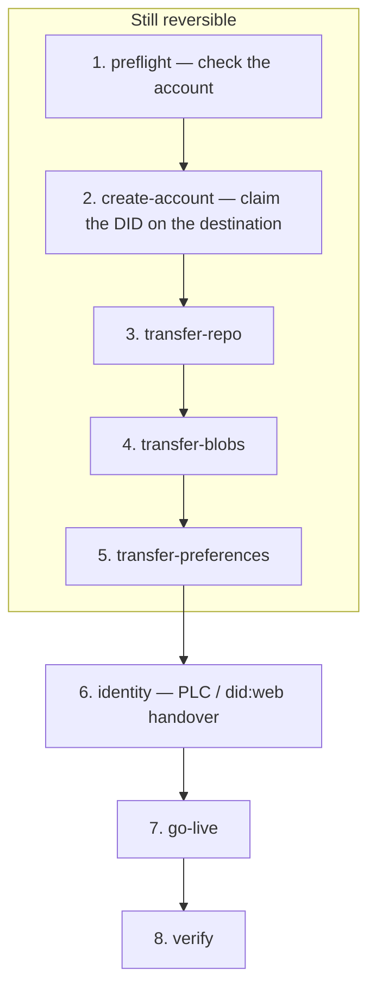

# at-migrate

[](https://github.com/WSocial-OSS/at-migrate/actions/workflows/ci.yml)
[](LICENSE)
[](CODE_OF_CONDUCT.md)
[](package.json)

Move an atproto account from any PDS to any other PDS — same DID, handle, posts, media, follows and followers.

**Tier 1 — supported.** This is the exit tool, shipped first, because "you can leave" has to be true.

Part of [W Social](https://github.com/WSocial-OSS).

## Quick start

Requires [Node.js 22+](https://nodejs.org/). No W account, invite, passport, or production credentials.

```bash
git clone https://github.com/WSocial-OSS/at-migrate.git
cd at-migrate
cp .env.example .env.local
npm install
npm run dev
```

Open http://localhost:3210. Copying `.env.example` is enough for local development.

Or open the repo in the [Dev Container](.devcontainer/devcontainer.json) (VS Code / GitHub Codespaces). Port 3210 is forwarded.

```bash
npm test            # unit tests
npm run typecheck
npm run build
```

## How it works

Standalone Next.js app for now, built so the moving parts can be lifted into the
WSocial signup flow later (see [Merging into WSocial](#merging-into-wsocial)).

### Why "and back" is free

Migration is symmetric. A run is a source host, a destination host, and one
account; reversing it means swapping the two hosts. There is no separate
"leaving" flow to build or keep correct — the swap button in the direction picker
*is* the return trip, and the receipt a completed run produces records the
reverse direction so the wizard can be seeded from it.

### Every atproto network fits

There is no hardcoded list of networks. Two mechanisms cover the whole protocol:

**The source is discovered, not chosen.** Type a handle and `/api/resolve`
resolves it to a DID, reads the DID document, and takes the PDS endpoint from
there. The form then re-labels itself around whatever it found. A self-hosted
server nobody has heard of works with no configuration — `bnewbold.net` resolves
to `pds.robocracy.org` and the wizard just gets on with it.

**The destination list is the network's own.** A relay has to know every PDS it
indexes, so `com.atproto.sync.listHosts` is the closest thing to a census —
about 1,770 listable servers. `src/lib/atproto/relay.ts` caches it for 30
minutes and keeps serving stale data if a refresh fails.

What that raw list needs, and `src/lib/atproto/registry.ts` supplies:

- **Bluesky is added back.** It never appears under its own name — only its 89
  internal `*.host.bsky.network` shards do, holding ~22.8M accounts. Those are
  collapsed out of the directory (you cannot sign up on one) and their accounts
  credited to `bsky.social`, or the largest network on atproto would be missing
  from the picker entirely. A shard reached by handle resolution is still the
  right endpoint to talk to — it just gets labelled "Bluesky".
- **Bridges are excluded.** `atproto.brid.gy` is the fourth-largest host by
  account count and is not an account home; offering it as a destination would
  only produce a confusing failure.
- **Throwaway deploys are excluded** — `*.up.railway.app`, `*.fly.dev`, tunnels.
  Still reachable by typing the hostname, just not advertised as somewhere to live.
- **Names where names exist.** Bluesky, W, EuroSky, Blacksky, Northsky, Spark,
  Tangled, Roomy, Surf and friends read as products; everything else honestly
  shows its hostname.

Scale forced the shape of the API. Probing 1,770 servers per page load is out of
the question, so `/api/hosts` has three modes: featured hosts probed on load,
`?q=` searching the full directory server side, and `?probe=host` verifying the
one server someone actually picked. Whatever the picker says, the engine
re-checks the destination with `describeServer` at preflight.

### What it actually does

The standard atproto account migration, in the order that keeps the account
recoverable for as long as possible:



| Step | Calls |
| --- | --- |
| Check the account | `login` on the source, DID document resolution, `com.atproto.server.checkAccountStatus`, `com.atproto.server.describeServer` on the destination |
| Claim the new account | `com.atproto.server.getServiceAuth` (aud = destination DID, lxm = `createAccount`) → `com.atproto.server.createAccount` on the destination with the existing DID |
| Move the data | `com.atproto.sync.getRepo` → `com.atproto.repo.importRepo`; `com.atproto.repo.listMissingBlobs` → `com.atproto.sync.getBlob` → `com.atproto.repo.uploadBlob`; `app.bsky.actor.getPreferences` → `putPreferences` |
| Hand over the identity | `com.atproto.identity.getRecommendedDidCredentials` → `requestPlcOperationSignature` → *(user enters emailed code)* → `signPlcOperation` on the source → `submitPlcOperation` on the destination. For `did:web`, the user publishes the document themselves and the app verifies it resolved. |
| Go live | `com.atproto.server.activateAccount` on the destination, `deactivateAccount` on the source |
| Verify | `checkAccountStatus` on the destination compared against the pre-migration inventory, plus a fresh DID resolution |

Nothing about the account changes until the identity step. Everything before it
leaves the old account live and serving, which is why the UI can honestly say
"still reversible" up to that point — `RunView.safeToAbandon` is the flag it
keys off, and it flips the moment the PLC operation is submitted.

### Deliberate behaviours worth knowing

- **A blob the old server cannot serve does not fail the run.** It is skipped,
  counted, logged, and listed in the receipt. Real repositories have dead blobs;
  stranding a migration over one would be worse than losing the attachment.
- **Preferences are best-effort.** They are convenience state, not identity, so a
  failure there marks the substep skipped rather than failing the move.
- **A half-finished run is resumable.** Blob transfer re-lists what is still
  missing each round instead of tracking its own cursor, and `create-account`
  adopts an account a previous attempt already created if the DID matches. Retry
  continues from the first step that has not completed.
- **App passwords are refused by design.** Migration needs real account auth. The
  form says so before the user hits the error, and the error says so again.
- **Two-factor is a pause, not a dead end.** `AuthFactorTokenRequired` turns into
  a blocker asking for the code, then retries the login.

## Configuration

```bash
cp .env.example .env.local
```

| Variable | Notes |
| --- | --- |
| `WSOCIAL_PDS_HOST` | `pds.wsocial.network` — the W PDS, confirmed against the live network (a W account, `anna.wsocial.eu`, resolves there). It serves `.wsocial.eu` handles and is **invite-only**, so the wizard asks arrivals for an invite code. Not `wsocial.news`, which is the marketing site; `api.wsocial.eu` and `bsky.wsocial.eu` are aliases of the same server, and `pds.wsocial.eu` currently 503s. |
| `EUROSKY_PDS_HOST` | Optional override. Defaults to `eurosky.social`, verified as a live PDS (`did:web:eurosky.social`). |
| `EXTRA_PDS_HOSTS` | Optional, `Label\|hostname` comma separated. Pins extra hosts ahead of the live directory. |
| `ATPROTO_RELAY_HOST` | Optional. Relay used for the host directory; defaults to `relay1.us-west.bsky.network`. |

Every host the wizard is actually asked to use is probed with
`com.atproto.server.describeServer` first, so a stale or wrong hostname degrades
to "not answering" instead of a broken run.

## Deployment constraint

Runs live in process memory (`src/lib/migration/store.ts`) and nowhere else,
because a run in flight holds the user's real account password. That rules out
spreading this across serverless instances: deploy it as a single long-lived
Node process. If WSocial later needs horizontal scaling, replace that one module
— the engine keeps no global state of its own.

Credentials are dropped when a run finishes, is canceled, or ages out (one hour),
and never appear in `RunView`, the SSE stream, the receipt, or the logs.

## Deploying (Railway)

`railway.json` builds with Nixpacks, starts with `npm run start` (which honours
Railway's injected `PORT`), and healthchecks `/api/health`. That endpoint reports
whether `WSOCIAL_PDS_HOST` is set, because a deploy can be green and still be a
broken environment if it is missing.

`numReplicas` is pinned to **1** on purpose. See the deployment constraint
above: runs live in the process that started them, so a second replica would
answer a blocker request for a run it has never heard of.

Set per-environment variables on the service (`WSOCIAL_PDS_HOST` at minimum),
then `railway up` — or connect the GitHub repo for push-to-deploy.

## Brand

The look is WSocial's, taken from wsocial.news rather than approximated:

- `src/app/globals.css` carries their exact tokens — light values from that site's
  `:root`, dark values from its `.dark` class, unchanged. Their `--link` (teal
  `#05857c` light, mint `#1df2ba` dark) is this app's primary accent; `--purple`
  marks the "your turn" states.
- Inter Tight via `next/font/google`, self-hosted at build time so no runtime
  request leaves the box.
- `public/logo/logo.svg` and `logo-LM.svg` are their dark and light marks;
  `src/app/favicon.ico` is their favicon. The masthead swaps marks on
  `prefers-color-scheme`, the same way their header does.
- Their house style is large radii (24–40px), borderless plum/white cards on a
  tinted ground, and pill buttons at weight 500 — matched here.

The product is called **W** in their own copy, so that is the label the wizard
uses for the home server. WSocial stays the company name.

If the palette on wsocial.news is retouched, the tokens at the top of
`globals.css` are the only place this app needs to follow.

## Architecture

```
src/lib/migration/engine.ts   MigrationRun — the whole migration, framework-free
src/lib/migration/types.ts    Domain types, including the Blocker union
src/lib/migration/store.ts    In-memory run registry (the swappable part)
src/lib/migration/receipt.ts  Downloadable record + the reverse direction
src/lib/atproto/relay.ts      Live host directory from a relay, cached
src/lib/atproto/registry.ts   Naming, and which hosts are not account homes
src/lib/atproto/*             Host probing, identity resolution, URL handling
src/app/api/*                 Thin HTTP layer: hosts/resolve, then start, observe (SSE), answer, retry, cancel
src/components/*              The wizard — a renderer of run state
```

The design that keeps the UI small: **whenever the engine needs something only
the user has, it does not fail — it publishes a `Blocker` and waits.** Sign-in
codes, destination account details, PLC tokens and `did:web` publication are all
the same mechanism. The client renders whatever blocker is current and posts an
answer back, so the wizard holds no step-ordering logic and the engine stays the
single source of truth about where a run is.

Progress reaches the browser as whole `RunView` snapshots over SSE. The client
replaces state rather than merging it, so a dropped frame cannot desynchronise
the UI.

## Merging into WSocial

The seam is deliberate:

1. `src/lib/migration/` and `src/lib/atproto/` have no Next.js imports and no
   React. Copy them in as-is.
2. Replace `store.ts` with whatever session mechanism WSocial already has.
3. The API routes under `src/app/api/` are thin enough to rewrite against
   WSocial's own router; the contract is *start a run, stream snapshots, answer
   blockers, retry, cancel, fetch receipt*.
4. `src/components/` is the part expected to be replaced by WSocial's own design
   system. `RunProgress` groups the eight engine steps into the five a person
   cares about, which is the piece worth keeping conceptually even if the markup
   changes.

For the signup-flow version, the natural shape is "already have an account
elsewhere?" as a branch on the signup screen, which skips the direction picker
(destination is always WSocial) and reuses everything else.

## Limits

- Only `did:plc` and `did:web` accounts. Anything else is refused in preflight.
- Direct messages and notification history are not part of an atproto
  repository, so they do not move. The UI says this before sign-in rather than
  after.
- A source handle issued by the old server (`you.bsky.social`) does not come
  with you; a handle on a domain you own does.
- The destination PDS must allow account creation with an existing DID via a
  service-auth token, which is the standard path but can be disabled.

## Contributing

See [CONTRIBUTING.md](CONTRIBUTING.md). Tight first tasks live in
[docs/good-first-issues.md](docs/good-first-issues.md).

English is the working language. Issues and pull requests in other languages are
welcome. Commits must be signed off (`git commit -s`) under the Developer
Certificate of Origin — there is no CLA.

## License

[MIT](LICENSE)

## Security

Please report vulnerabilities through
[GitHub private vulnerability reporting](https://github.com/WSocial-OSS/at-migrate/security/advisories/new)
only. See [SECURITY.md](SECURITY.md).
